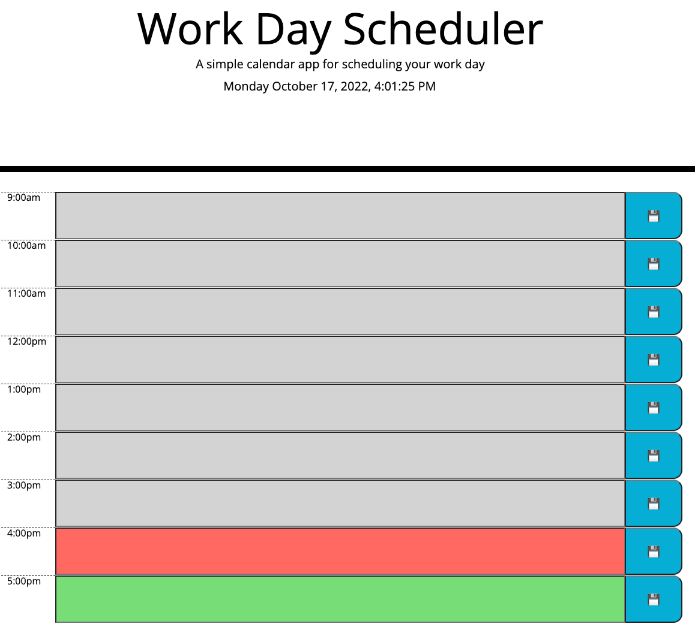

# Day Planner

[Enter here!](https://jaime-a-esquivel-a.github.io/DayPlanner/Develop/index.html)

##### This planner will help you to schedule your activities during office hours 9AM-5PM.

- Saved activities will be stored in local storage. So you can refresh/close page and still recover your activities.
- You´ll find in the title the current date, weekday and hour.
- According to the current hour the time blocks will either be:
    - Color gray: time block is in the past.
    - Color red: current time block.
    - Color green: time block is in the future.

 

